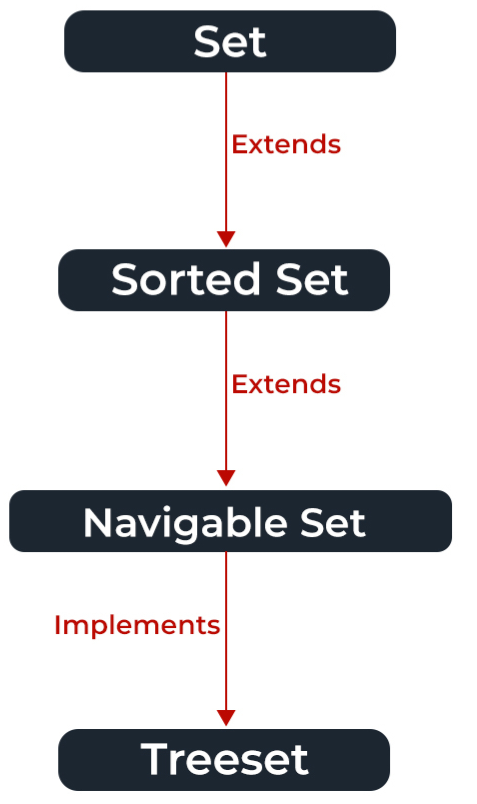

# Collections In Java


The Java collections framework is a set of classes and interfaces that implement commonly reusable collection data structures. Although referred to as a framework, it works in a manner of a library. The collections framework provides both interfaces that define various collections and classes that implement them.
<br/>

## Sneak Peak of Collections


## Classes and Interfaces


## Set Interfaces


The set interface is present in java.util package and extends the Collection interface. It is an unordered collection of objects in which duplicate values cannot be stored. It is an interface that implements the mathematical set. This interface contains the methods inherited from the Collection interface and adds a feature that restricts the insertion of the duplicate elements. There are two interfaces that extend the set implementation namely SortedSet and NavigableSet.



In the above image, the navigable set extends the sorted set interface. Since a set doesn’t retain the insertion order, the navigable set interface provides the implementation to navigate through the Set. The class which implements the navigable set is a TreeSet which is an implementation of a self-balancing tree. Therefore, this interface provides us with a way to navigate through this tree.

**Declaration:** The Set interface is declared as:

```sudo
// Obj is the type of the object to be stored in Set 
Set<Obj> set = new HashSet<Obj> ();
```


## Map Interfaces

In Java, Map Interface is present in java.util package represents a mapping between a key and a value. Java Map interface is not a subtype of the Collection interface. Therefore it behaves a bit differently from the rest of the collection types.

A map contains unique keys.Maps are perfect to use for key-value association mapping such as dictionaries. The maps are used to perform lookups by keys or when someone wants to retrieve and update elements by keys. Some common scenarios are as follows: 
- A map of error codes and their descriptions.
- A map of zip codes and cities.
- A map of managers and employees. Each manager (key) is associated with a list of employees (value) he manages.
- A map of classes and students. Each class (key) is associated with a list of students (value).

**Syntax:** Defining Type-safe Map
```sudo
Map hm = new HashMap(); 
// Obj is the type of the object to be stored in
```
## List Interfaces

The List interface in Java provides a way to store the ordered collection. It is a child interface of Collection. It is an ordered collection of objects in which duplicate values can be stored. Since List preserves the insertion order, it allows positional access and insertion of elements.
<br/>

<br/>
The List interface is found in java.util package and inherits the Collection interface. It is a factory of the ListIterator interface. Through the ListIterator, we can iterate the list in forward and backward directions. The implementation classes of the List interface are ArrayList, LinkedList, Stack, and Vector. ArrayList and LinkedList are widely used in Java programming. The Vector class is deprecated since Java 5

**Declaration of Java List Interface**
```sudo
public interface List<E> extends Collection<E> ;
```
## Queues Interfaces 


The Queue interface is present in java.util package and extends the Collection interface is used to hold the elements about to be processed in FIFO(First In First Out) order. It is an ordered list of objects with its use limited to inserting elements at the end of the list and deleting elements from the start of the list, (i.e.), it follows the FIFO or the First-In-First-Out principle.

In Java, the Queue interface is a subtype of the Collection interface and represents a collection of elements in a specific order. It follows the first-in, first-out (FIFO) principle, which means that the elements are retrieved in the order in which they were added to the queue.This type-safe queue can be defined as:
```sudo
// Obj is the type of the object to be stored in Queue 
Queue<Obj> queue = new PriorityQueue<Obj> ();
```
