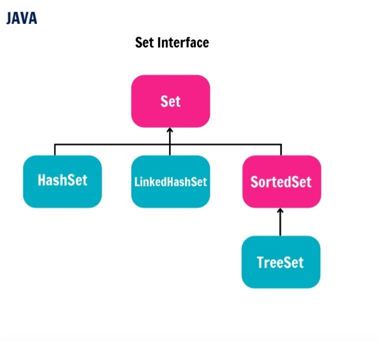
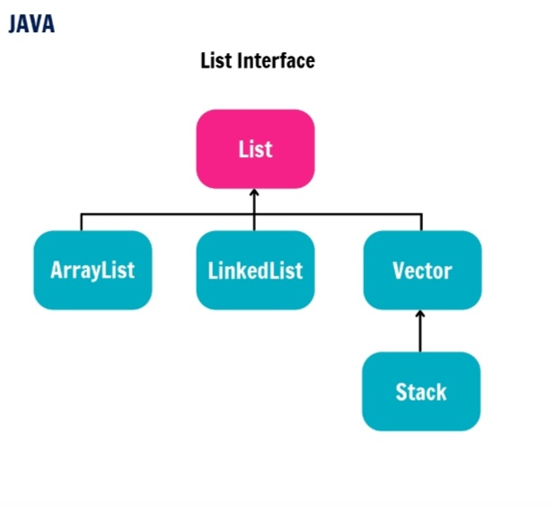

# Collections In Java

The Java collections framework is a set of classes and interfaces that implement commonly reusable collection data structures. Although referred to as a framework, it works in a manner of a library. The collections framework provides both interfaces that define various collections and classes that implement them.
 

## Sneak Peak of Collections

## Classes and Interfaces

## Set Interfaces

## Map Interfaces

## List Interfaces

## Queues Interfaces 

| Method | Description |
|--------|--------------|
|.add(Object)|This method is used to add an object to the collection|.addAll(Collection c)|This method adds all the elements in the given collection to this collection|.clear()|This method removes all of the elements from this collection|.contains(Object o)This method returns true if the collection contains the specified element|.containsAll(Collection c)|This method returns true if the collection contains all of the elements in the given collection|.equals(Object o)|This method compares the specified object with this collection for equality|.hashCode()|This method is used to return the hash code value for this collection|.isEmpty()|This method returns true if this collection contains no elements|.iterator()|This method returns an iterator over the elements in this collection|.max()|
 This method is used to return the maximum value present in the collection|.
parallelStream()|This method returns a parallel Stream with this collection as its source|.remove(Object o)|This method is used to remove the given object from the collection. If there are duplicate values, then this method removes the first occurrence of the object|.removeAll(Collection c)|This method is used to remove all the objects mentioned in the given collection from the collection|.removeIf(Predicate filter)|This method is used to remove all the elements of this collection that satisfy the given predicate|.retainAll(Collection c)|This method is used to retain only the elements in this collection that are contained in the specified collection|.size()|This method is used to return the number of elements in the collection|.spliterator()|This method is used to create a Spliterator over the elements in this collection|.stream()|This method is used to return a sequential Stream with this collection as its source|.toArray()|This method is used to return an array containing all of the elements in this collection.|
