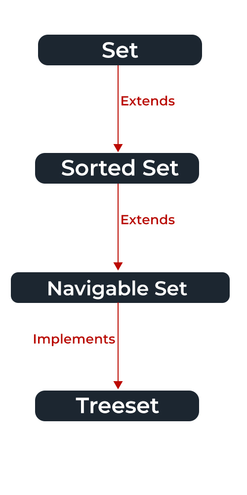

# Collections In Java

The Java collections framework is a set of classes and interfaces that implement commonly reusable collection data structures. Although referred to as a framework, it works in a manner of a library. The collections framework provides both interfaces that define various collections and classes that implement them.
 

## Sneak Peak of Collections

## Classes and Interfaces

## Set Interfaces

The set interface is present in java.util package and extends the Collection interface. It is an unordered collection of objects in which duplicate values cannot be stored. It is an interface that implements the mathematical set. This interface contains the methods inherited from the Collection interface and adds a feature that restricts the insertion of the duplicate elements. There are two interfaces that extend the set implementation namely SortedSet and NavigableSet.

In the above image, the navigable set extends the sorted set interface. Since a set doesn’t retain the insertion order, the navigable set interface provides the implementation to navigate through the Set. The class which implements the navigable set is a TreeSet which is an implementation of a self-balancing tree. Therefore, this interface provides us with a way to navigate through this tree.

Declaration: The Set interface is declared as:

## Map Interfaces

## List Interfaces

## Queues Interfaces 

