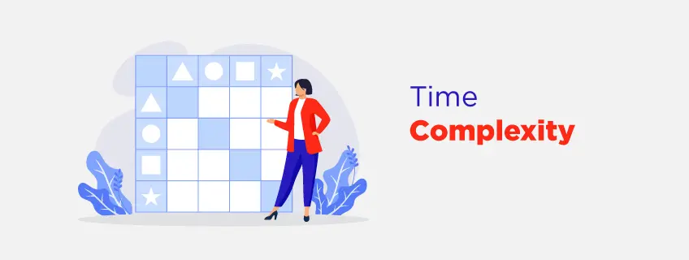

# Time Complexity in Data Structures



## Introduction
Time complexity is a critical concept in computer science, playing a vital role in the design and analysis of efficient algorithms and data structures. It measures the amount of time an algorithm or data structure takes to execute, crucial for understanding efficiency and scalability.

## What is Time Complexity?
Time complexity measures how many operations an algorithm completes in relation to the size of the input. It helps in analyzing an algorithm's performance scaling with increasing input size. Big O notation (O()) is commonly used to denote time complexity, providing an upper bound on how quickly an algorithm's execution time will increase.

## Best, Worst, and Average Case Complexity
When analyzing algorithms, three types of time complexity are considered:

- **Best-case complexity (O(best))**: Minimum time required for an algorithm to complete with optimal input.
- **Worst-case complexity (O(worst))**: Maximum time an algorithm takes to finish for any given input.
- **Average-case complexity (O(average))**: Typical running time averaged over all possible inputs.

## Big O Notation
Time complexity is often expressed using Big O notation, representing the maximum possible running time for an algorithm given the size of the input.

### a) O(1) - Constant Time Complexity
Algorithm takes the same time to execute regardless of input size.

```python
def constant_time_example(arr):
    return arr[0]

arr = [1, 2, 3, 4, 5]
print(constant_time_example(arr))  # Output: 1
```

### b) O(log n) - Logarithmic Time Complexity
Execution time increases logarithmically with input size.

```python
def binary_search(arr, target):
    low, high = 0, len(arr) - 1
    
    while low <= high:
        mid = (low + high) // 2
        
        if arr[mid] == target:
            return mid
        elif arr[mid] < target:
            low = mid + 1
        else:
            high = mid - 1
    
    return -1

arr = [1, 2, 3, 4, 5, 6, 7, 8, 9, 10]
print(binary_search(arr, 6))  # Output: 5 (index of 6 in the array)
```

### c) O(n) - Linear Time Complexity
Execution time grows linearly with input size.

```python
def linear_time_example(arr):
    total = 0
    for num in arr:
        total += num
    return total

arr = [1, 2, 3, 4, 5]
print(linear_time_example(arr))  # Output: 15 (sum of elements)
```

### d) O(n^2) - Quadratic Time Complexity
Execution time grows quadratically with input size.

```python
def print_pairs(arr):
    for i in range(len(arr)):
        for j in range(len(arr)):
            print(f"({arr[i]}, {arr[j]})", end=" ")
        print()

arr = [1, 2, 3, 4]
print_pairs(arr)
# Output:
# (1, 1) (1, 2) (1, 3) (1, 4)
# (2, 1) (2, 2) (2, 3) (2, 4)
# (3, 1) (3, 2) (3, 3) (3, 4)
# (4, 1) (4, 2) (4, 3) (4, 4)
```

### e) O(2^n) - Exponential Time Complexity
Execution time doubles with each additional element in input.

```python
def fibonacci(n):
    if n <= 1:
        return n
    return fibonacci(n - 1) + fibonacci(n - 2)

print(fibonacci(6))  # Output: 8 (6th Fibonacci number)
```

### f) O(n!) - Factorial Time Complexity
Execution time increases factorial with input size.

```python
def permute(string, l, r):
    if l == r:
        print("".join(string))
    else:
        for i in range(l, r + 1):
            string[l], string[i] = string[i], string[l]
            permute(string, l + 1, r)
            string[l], string[i] = string[i], string[l]

string = "abc"
n = len(string)
permute(list(string), 0, n - 1)
# Output:
# abc
# acb
# bac
# bca
# cab
# cba
```

## Time Complexity of Different Data Structures
Here are the time complexities associated with common data structures in Python:

### Arrays
- Access: O(1)
- Search: O(n)
- Insertion (at the end): O(1)
- Insertion (at the beginning or middle): O(n)
- Deletion (from the end): O(1)
- Deletion (from the beginning or middle): O(n)

### Linked Lists
- Access: O(n)
- Search: O(n)
- Insertion (at the beginning): O(1)
- Insertion (at the end): O(1)
- Insertion (in the middle): O(n)
- Deletion (from the beginning): O(1)
- Deletion (from the end): O(1)
- Deletion (from the middle): O(n)

### Stacks
- Push: O(1)
- Pop: O(1)
- Peek: O(1)

### Queues
- Enqueue: O(1)
- Dequeue: O(1)
- Peek: O(1)

### Hash Tables
- Search: O(1) - average case
- Insertion: O(1) - average case
- Deletion: O(1) - average case

### Binary Search Trees (BSTs)
- Search: O(log n) - average case
- Insertion: O(log n) - average case
- Deletion: O(log n) - average case

### AVL Tree
- Searching for an element: O(log n)
- Insertion of an element: O(log n)
- Deletion of an element: O(log n)

### B-Tree
- Searching for an element: O(log n)
- Insertion of an element: O(log n)
- Deletion of an element: O(log n)

### Red-Black Tree
- Searching for an element: O(log n)
- Insertion of an element: O(log n)
- Deletion of an element: O(log n)

## Analyzing Algorithms with Time Complexity
Understanding time complexity helps in selecting efficient algorithms and data structures for specific tasks. It provides insights into scalability and performance as input sizes increase.

For example, for frequent searches in a large dataset, a Binary Search Tree (BST) with O(log n) search time is efficient. For frequent insertions and deletions, a linked list or an array might be preferable due to their O(1) insertion and deletion times at the beginning.

## Conclusion
Time complexity in data structures is crucial for analyzing algorithm efficiency and performance. It measures how long an algorithm takes to run as input size increases, guiding algorithm design and optimization decisions.

By leveraging time complexity analysis, developers can identify bottlenecks, choose optimal algorithms, and enhance overall system performance. It forms the foundation of algorithmic analysis, essential for building scalable and efficient software systems.
