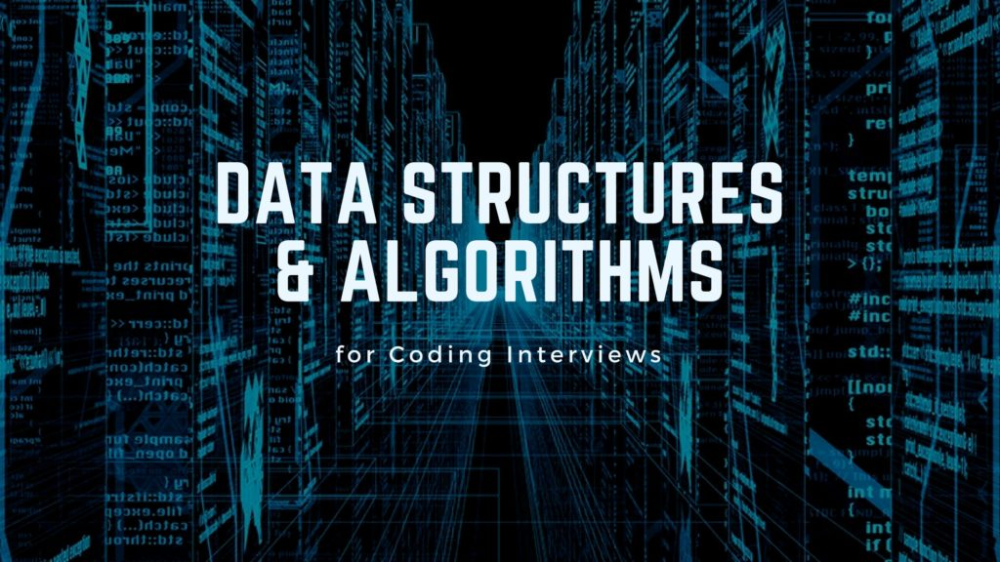

# Data Structures and Algorithms

Welcome to our repository dedicated to Data Structures and Algorithms! Here, you'll find implementations of various data structures and algorithms in multiple programming languages.

---

## Data Structures

| Data Structure    | Description                                       |
|-------------------|---------------------------------------------------|
| Array             | Basic array data structure implementation.        |
| Linked List       | Implementation of singly and doubly linked lists. |
| Stack             | Implementation of stack data structure.           |
| Queue             | Implementation of queue data structure.           |
| Tree              | Implementation of binary, AVL, and red-black trees. |
| Graph             | Implementation of graph data structure.           |

---

## Algorithms

| Algorithm                  | Description                                            |
|----------------------------|--------------------------------------------------------|
| Sorting Algorithms         | Various sorting algorithms: bubble, insertion, selection, merge, quick sort. |
| Search Algorithms          | Linear search, binary search, DFS, BFS.                |
| Graph Algorithms           | DFS, BFS, Dijkstra's algorithm, Prim's algorithm, Kruskal's algorithm. |
| Dynamic Programming        | Solutions to classic problems like knapsack problem and longest common subsequence problem. |

---

## Usage

Each data structure and algorithm is implemented in separate files or directories, organized by programming language. You can easily use them in your own projects by including the relevant files or directories.

---

## Contributing

Contributions are welcome! If you'd like to contribute to this repository, feel free to fork it and submit a pull request with your changes.

---

## License

This repository is licensed under the MIT License. See the [LICENSE](LICENSE) file for details.
